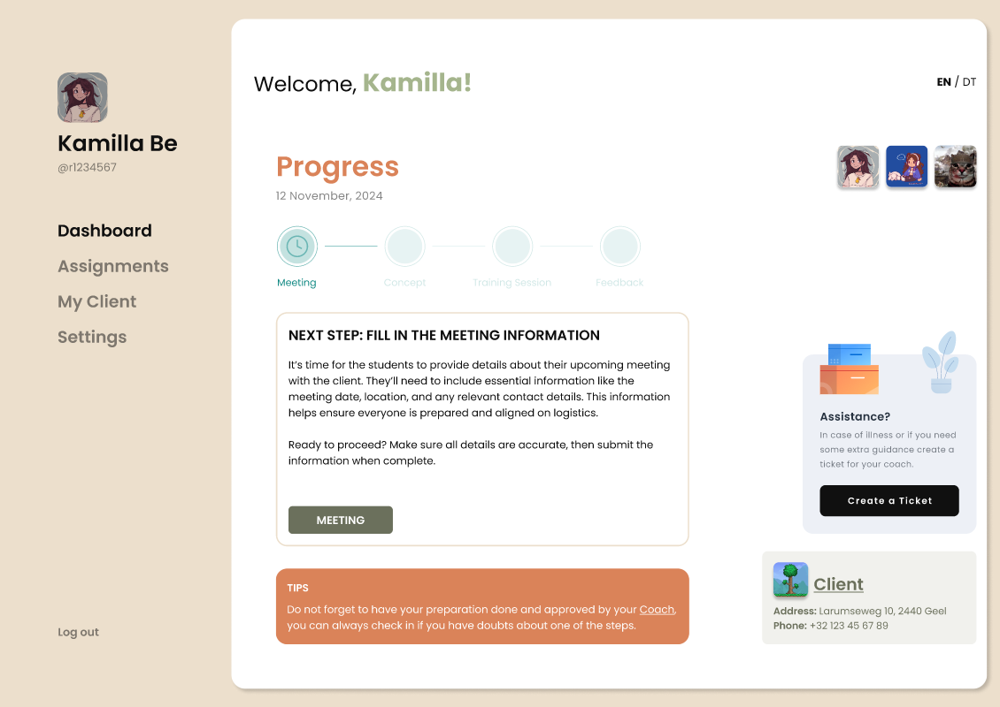

# 🌐 E-Portfolio | Thomas More University

Welcome to my interactive e-portfolio! This project showcases my academic and personal development throughout my time at Thomas More University. It includes key highlights from group projects, individual contributions, technical tools, and reflections on what I've learned across multiple domains like UI/UX, full-stack web development, IoT systems, and team collaboration.

---

## 📁 Live Website

🔗 [Visit my e-Portfolio](https://your-deployed-link-here.com)

---

## 🛠️ Tech Stack

This portfolio is built using:

- **HTML5** & **CSS3**
- **Tailwind CSS**
- **JavaScript**
- **Responsive Design**
- **Figma** (for UI/UX prototyping)

---

## 💼 Featured Projects

### 🎓 Skills 2 | EduQuest
- Designed a high-fidelity **Figma prototype** based on use cases.
- Defined and analyzed **functional and non-functional requirements**.
- Ensured accessibility for 3 types of users: students, coaches, and admins.
- **Role**: UI/UX lead, documentation support, system analysis.

👉 [Figma Link](#) *(Link placeholder — update if available)*

---

### 🔧 IoT | Security System
- Combined **OpenCV**, **Python**, and **Orange Pi** to build a smart water turret.
- Used **stepper motors** for tracking and **fog machines** for defense mechanisms.
- Contributed to software development, testing, and integration.
- **Role**: Python contributor, Orange Pi setup assistant, team support.

📄 [Final Report PDF](../assets/images/projects/iot/annotated-IOT-Final-TeamReport2024.pdf)

---

### 🌍 Skills 2 | TMIP (Thomas More International Platform)
- Ongoing full-stack web application to support international students.
- Built using **Laravel**, **PHP**, **Tailwind CSS**, and **Jira/Scrum** for agile management.
- Features include **user roles**, **status updates**, **nominations**, and **buddy system**.
- **Role**: Database design, homepage & chat/forum feature, client meetings & demos.
- Challenges: Implementing role-based access and permissions across the system.

🛠️ *Status: In Development – Final release will be updated here.*

---

## 📌 Highlights

- 💬 Regular client demos and feedback sessions
- 📈 Used **Jira** and **Scrum methodology** in real-world sprints
- 🎯 Focus on usability, structure, and real-world tools
- 🤝 Collaboration, peer support, and iterative improvements

---

## 📸 Screenshots

> 
> 

---

## 📚 Learning Outcomes

- Improved my skills in **UI/UX**, **web development**, and **embedded systems**
- Learned to work with tools like **Laravel**, **Figma**, **Jira**, **OpenCV**
- Strengthened my **teamwork**, **communication**, and **project organization**
- Learned to **ask for help**, **adapt to unfamiliar tech**, and contribute meaningfully

---

## 📫 Contact

If you'd like to collaborate or learn more, feel free to reach out:

- 💼 [LinkedIn](https://www.linkedin.com/in/betancourthgab/)
- 📧 Email: betancourth.gab@gmail.com

---

> This portfolio will continue to evolve as I learn and build more — stay tuned!
